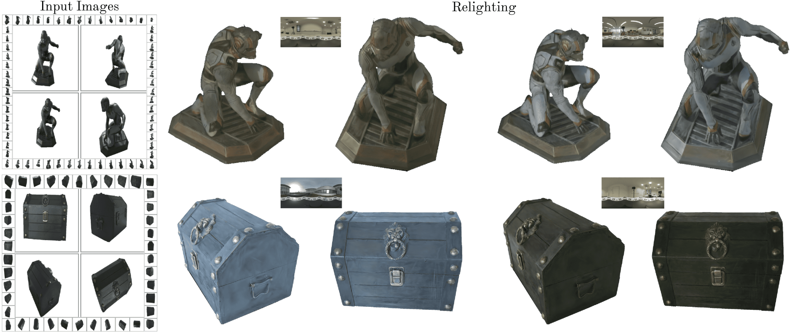

# <p align="center"> 💡<font color=#F0F000>LightSwitch</font>💡: Multi-view Relighting with Material-guided Diffusion </p>

#####  <p align="center"> [Yehonathan Litman](https://yehonathanlitman.github.io/), [Fernando De la Torre](https://www.cs.cmu.edu/~ftorre/), [Shubham Tulsiani](https://shubhtuls.github.io/)</p>
##### <p align="center"> ICCV 2025

#### <p align="center">[📑 Paper](https://arxiv.org/abs/TODO) | [🖥️ Webpage](https://yehonathanlitman.github.io/light_switch/) | <a href="https://huggingface.co/thebluser">🤗 Demo</a><br><br>
    


# Installation

#### TODO

# Running

#### TODO

# HuggingFace Demo 🤗

#### TODO

# Citation

If you use any parts of our work, please cite the following:

```
@inproceedings{litman2025lightswitch,
  author    = {Yehonathan Litman and Fernando De la Torre and Shubham Tulsiani},
  title     = {LightSwitch: Multi-view Relighting with Material-guided Diffusion},
  booktitle = {ICCV},
  year      = {2025}
}
```